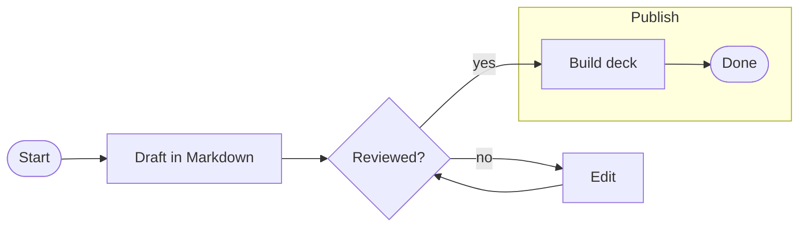

## Diagrams in Markdown

```mermaid steps label="Review flow"
flowchart LR
    S(["Start"]) --> A["Draft in Markdown"]
    A --> B{"Reviewed?"}
    B -- yes --> C["Build deck"]
    B -- no --> D["Edit"]
    D --> B
    subgraph out["Publish"]
      C --> E(["Done"])
    end
```

Note: Press the arrow key to step through. Same block works in an md-doc document.
