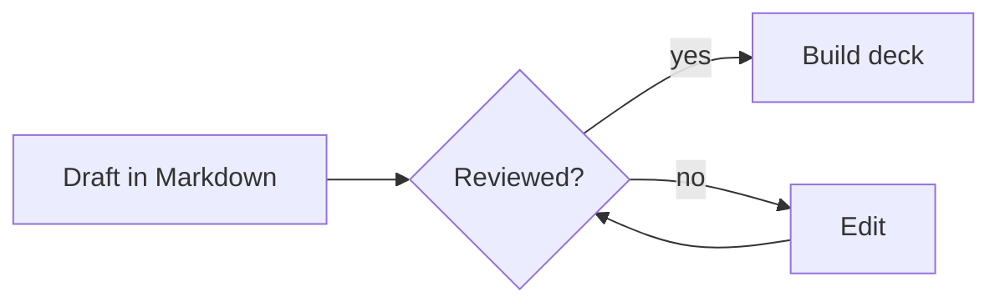

## Diagrams from md-doc

```mermaid
flowchart LR
    A["Draft in Markdown"] --> B{"Reviewed?"}
    B -- "yes" --> C["Build deck"]
    B -- "no" --> D["Edit"]
    D --> B
```

Note: Drawn by md-doc's own renderer, so it matches the same block in a document.
